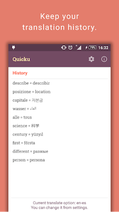

Quicku: Highlight to translate  
------------------------------
Quicku is a translator app but not a regular one. It helps you when you faced a word that you don't know the meaning in a foreign article while you read on mobile browser or an app. Just long click the word and share it to Quicku. Then you will get instant translation of that word. You'll get your answer quickly and continue to read without leaving your article.

Whole idea is simple as this. I first developed this app in 2016 and released on Google Play. Actually I've tried to sell it with a small amount of pricing. But very few people bought it. Very few :) Then I decided to unpublish the app after a short period of the release and it stayed unpublished for a long time. At the end of 2017 I decided to open source Quicku and re-publish on Google Play for free. 

Current code is working fine but I wanted to refactor and change its architecture to MVP, use different libraries, convert some Java file into Kotlin and use this open source project as a playground. Also I might add some new cool features and I'm open for suggestions and discussions.

This project uses [Yandex Translation API][1] and its requiered keys. In order to run it you have to create your own **key.properties** file and add your **key/value** parameters.

Demo
----
  

*To be continued...*

[1]: https://tech.yandex.com/translate/